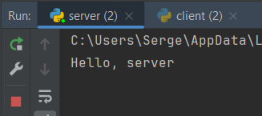

## **Задание:**

Реализовать клиентскую и серверную часть приложения. Клиент отправляет серверу сообщение «Hello, server», и оно должно отобразиться на стороне сервера. В ответ сервер отправляет клиенту сообщение «Hello, client», которое должно отобразиться у клиента.

## **Решение:**

Клиентская часть:

   - Клиент создает UDP-сокет и подключается к серверу.
   - Отправляет сообщение «Hello, server» на сервер.
   - Получает от сервера ответ и выводит его на экран.
   - Сокет закрывается.
   
Серверная часть:

   - Сервер создает UDP-сокет и привязывается к локальному адресу.
   - Ждет получения сообщений от клиентов.
   - Принимает сообщение от клиента, выводит его на экран и отправляет ответное сообщение «Hello, client».
   - Цикл повторяется для новых подключений.

## **Код:**

client.py
```python
import socket

request = 'Hello, server'

client_socket = socket.socket(socket.AF_INET, socket.SOCK_DGRAM)
client_socket.connect(('localhost', 8080))

client_socket.send(request.encode())
response, server_address = client_socket.recvfrom(1024)

print(response.decode())

client_socket.close()
```

server.py
```python
import socket

response = 'Hello, client'

server_socket = socket.socket(socket.AF_INET, socket.SOCK_DGRAM)
server_socket.bind(('localhost', 8080))

while True:
    request, client_address = server_socket.recvfrom(1024)

    print(request.decode())

    server_socket.sendto(response.encode(), client_address)
```

## **Скриншоты:**



