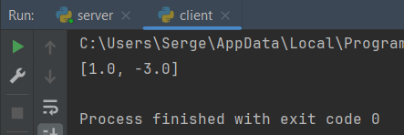

## **Задание:**

Реализовать клиентскую и серверную часть приложения. Клиент запрашивает выполнение решения квадратного уравнения, параметры которого вводятся с клавиатуры. Сервер обрабатывает данные и возвращает результат клиенту.

## **Решение:**

Клиентская часть:

   - Клиент создает TCP-сокет и подключается к серверу.
   - Отправляет параметры для решения квадратного уравнения (a, b, c).
   - Получает результат и выводит его на экран.

Серверная часть:

   - Сервер создает TCP-сокет и ждет подключения клиентов.
   - Принимает параметры, решает квадратное уравнение и отправляет результат клиенту.
   - Обрабатывает ошибки, если входные данные некорректны.

## **Код:**

client.py
```python
import socket

a, b, c = 1, 2, -3

client_socket = socket.socket(socket.AF_INET, socket.SOCK_STREAM)
client_socket.connect(('localhost', 8080))

client_socket.send(f"{a} {b} {c}".encode())
result = client_socket.recv(1024)

print(list(map(float, result.decode().split())))

client_socket.close()
```

server.py
```python
import socket
import math


def solve_quadratic(a, b, c):
    discriminant = b**2 - 4*a*c
    if discriminant > 0:
        x1 = (-b + math.sqrt(discriminant)) / (2 * a)
        x2 = (-b - math.sqrt(discriminant)) / (2 * a)
        ans = [x1, x2]
    elif discriminant == 0:
        x = -b / (2 * a)
        ans = [x]
    else:
        ans = []
    return " ".join(list(map(str, ans)))


server_socket = socket.socket(socket.AF_INET, socket.SOCK_STREAM)
server_socket.bind(('localhost', 8080))
server_socket.listen(1)

while True:
    client_socket, client_address = server_socket.accept()
    request = client_socket.recv(1024).decode()

    try:
        a1, b1, c1 = map(float, request.split())
        result = solve_quadratic(a1, b1, c1)
    except ValueError:
        result = "Error: Введите три действительных числа."

    client_socket.sendall(result.encode())
    client_socket.close()
```

## **Скриншоты:**


