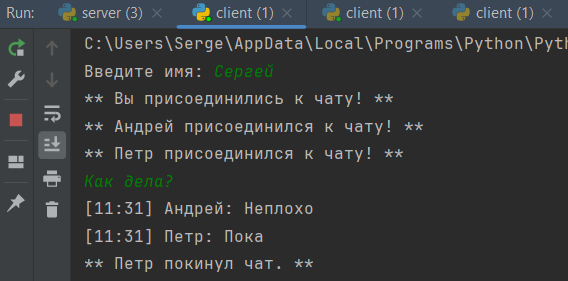
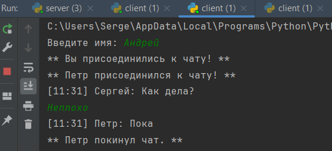
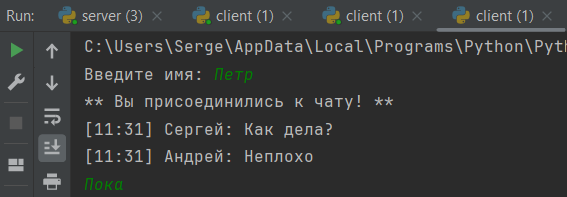

## **Задание:**

Реализовать многопользовательский чат.

## **Решение:**

Клиентская часть:

   - Клиент подключается к серверу и отправляет свое имя.
   - Запускает потоки для отправки и получения сообщений.
   - Обрабатывает сообщения от сервера и выводит их на экран.

Серверная часть:

   - Сервер создает TCP-сокет и слушает входящие подключения.
   - Для каждого нового клиента создается отдельный поток.
   - Каждый клиент получает имя и может отправлять сообщения другим участникам.
   - Сервер управляет списком клиентов и рассылает сообщения всем, кроме отправителя.

## **Код:**

client.py
```python
import socket
import threading

name = input("Введите имя: ")


def receive_messages(client_sock):
    while True:
        try:
            print(client_sock.recv(1024).decode())
        except:
            print("** Ошибка подключения. **")
            client_sock.close()
            break


def send_messages(client_sock):
    while True:
        try:
            client_sock.send(input().encode('utf-8'))
        except:
            print("** Ошибка отправки сообщения. **")
            client_sock.close()
            break


client_socket = socket.socket(socket.AF_INET, socket.SOCK_STREAM)
client_socket.connect(('localhost', 8080))

client_socket.send(name.encode())

receive_thread = threading.Thread(target=receive_messages, args=(client_socket,))
receive_thread.start()

send_thread = threading.Thread(target=send_messages, args=(client_socket,))
send_thread.start()

print("** Вы присоединились к чату! **")
```

server.py
```python
import socket
import threading
from datetime import datetime

clients = {}


def handle_client(client_sock):
    try:
        name = client_sock.recv(1024).decode()
        clients[client_sock] = name
        print(f'{name} присоединился к чату.')

        broadcast(f'** {name} присоединился к чату! **', client_sock)

        while True:
            message = client_sock.recv(1024).decode()
            if message:
                formatted_message = f'[{datetime.now().strftime("%H:%M")}] {name}: {message}'
                broadcast(formatted_message, client_sock)
            else:
                remove_client(client_sock)
                break
    except:
        remove_client(client_sock)


def broadcast(message, client_sock):
    for client in clients:
        if client != client_sock:
            try:
                client.send(message.encode())
            except:
                remove_client(client)


def remove_client(client_sock):
    if client_sock in clients:
        name = clients[client_sock]
        print(f'{name} отключился.')
        broadcast(f'** {name} покинул чат. **', client_sock)
        clients.pop(client_sock)
        client_sock.close()


server_socket = socket.socket(socket.AF_INET, socket.SOCK_STREAM)
server_socket.bind(('localhost', 8080))
server_socket.listen()
print(f'Сервер запущен')

while True:
    client_socket, client_address = server_socket.accept()
    print(f'Новое подключение от {client_address}')

    thread = threading.Thread(target=handle_client, args=(client_socket,))
    thread.start()
```

## **Скриншоты:**






