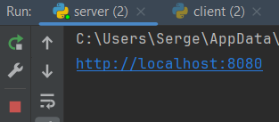
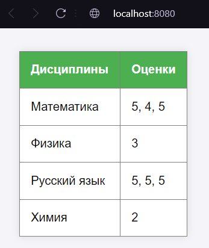

## **Задание:**

Написать простой веб-сервер для обработки GET и POST HTTP-запросов с помощью библиотеки socket в Python.

## **Решение:**

Серверная часть:

   - Создается TCP-сокет и сервер начинает слушать входящие подключения.
   - Принимает HTTP-запрос, определяет метод (GET или POST).
   - В случае GET возвращает HTML-страницу, в случае POST сохраняет данные в JSON-файл.
   - Обрабатывает ошибки и формирует соответствующие HTTP-ответы.

## **Код:**

client.py
```python
import os
import json
import socket
import urllib.parse


class MyHTTPServer:
    def __init__(self, host, port):
        self.host = host
        self.port = port
        self.save_file = 'save.json'
        self.html_file = 'index.html'

    def serve_forever(self):
        server_socket = socket.socket(socket.AF_INET, socket.SOCK_STREAM)
        server_socket.bind((self.host, self.port))
        server_socket.listen(1)

        while True:
            client_socket, _ = server_socket.accept()
            client_socket.settimeout(5)
            self.serve_client(client_socket)
            client_socket.close()

    def serve_client(self, client_socket):
        try:
            request = client_socket.recv(1024).decode()
            print(request)

            method, url, _ = self.parse_request(request)

            if method == 'GET':
                response_body = self.handle_get(url)
            elif method == 'POST':
                response_body = self.handle_post(request)
            else:
                response_body = "Method Not Allowed"

            self.send_response(client_socket, response_body)
        except Exception:
            pass

    @staticmethod
    def parse_request(request):
        lines = request.split('\r\n')
        request_line = lines[0]
        method, url, _ = request_line.split(' ')
        return method, url, _

    @staticmethod
    def parse_headers(request):
        lines = request.split('\r\n')
        headers = {}
        for line in lines[1:]:
            if line == '':
                break
            key, value = line.split(': ', 1)
            headers[key] = value
        return headers

    def handle_get(self, url):
        if url == '/':
            return self.generate_html_page()
        else:
            return "404 Not Found"

    def handle_post(self, request):
        headers = self.parse_headers(request)
        content_length = int(headers.get('Content-Length', 0))
        body = request.split('\r\n\r\n', 1)[1] if content_length > 0 else ''

        try:
            post_data = urllib.parse.parse_qs(body)
            discipline = post_data.get('discipline', [''])[0]
            grade = int(post_data.get('grade', ['0'])[0])

            grades = self.load_grades()
            if discipline in grades:
                grades[discipline].append(grade)
            else:
                grades[discipline] = [grade]
            self.save_grades(grades)
            return "Data saved successfully!"
        except Exception as e:
            return f"Error: {str(e)}"

    @staticmethod
    def send_response(client_socket, body):
        http_response = (
            "HTTP/1.1 200 OK\r\n"
            "Content-Type: text/html; charset=UTF-8\r\n"
            f"Content-Length: {len(body.encode())}\r\n"
            "Connection: close\r\n"
            "\r\n"
            + body
        )
        client_socket.sendall(http_response.encode())

    def load_grades(self):
        if os.path.exists(self.save_file):
            with open(self.save_file, 'r', encoding='utf-8') as file:
                return json.load(file)
        return {}

    def save_grades(self, grades):
        with open(self.save_file, 'w', encoding='utf-8') as file:
            json.dump(grades, file, ensure_ascii=False, indent=4)

    @staticmethod
    def generate_table_rows(grades):
        rows = ""
        for discipline, grade_list in grades.items():
            grades_str = ', '.join(list(map(str, grade_list)))
            rows += f'<tr><td>{discipline}</td><td>{grades_str}</td></tr>\n'
        return rows

    def generate_html_page(self):
        with open(self.html_file, 'r', encoding='utf-8') as file:
            html_template = file.read()

        grades = self.load_grades()
        table_rows = self.generate_table_rows(grades)

        html_page = html_template.replace('{{ table_rows }}', table_rows)
        return html_page


server = MyHTTPServer('localhost', 8080)
try:
    server.serve_forever()
except KeyboardInterrupt:
    pass
```

## **Скриншоты:**




