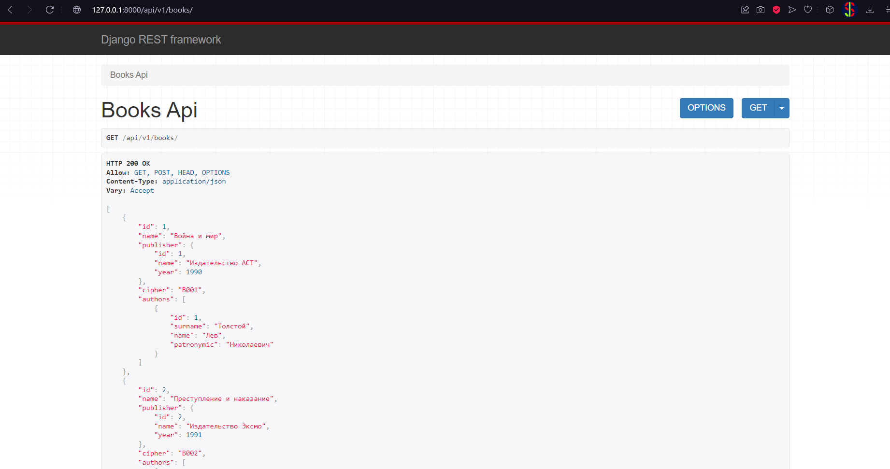
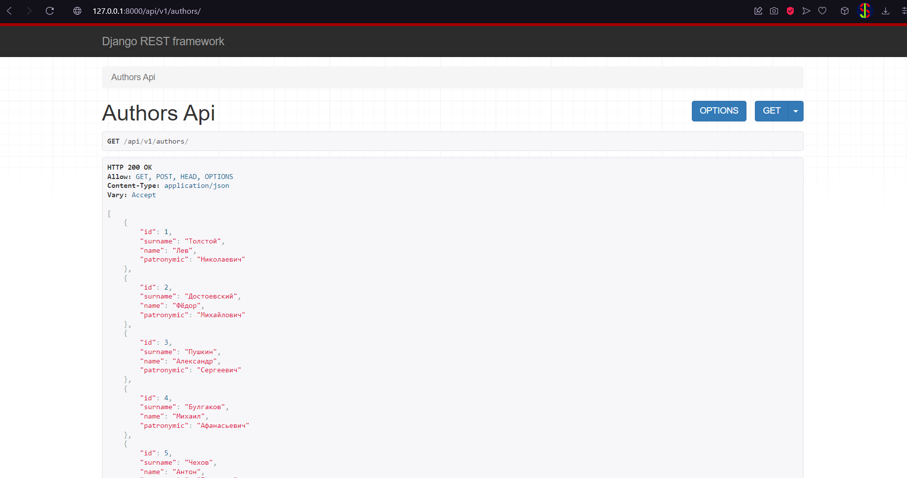
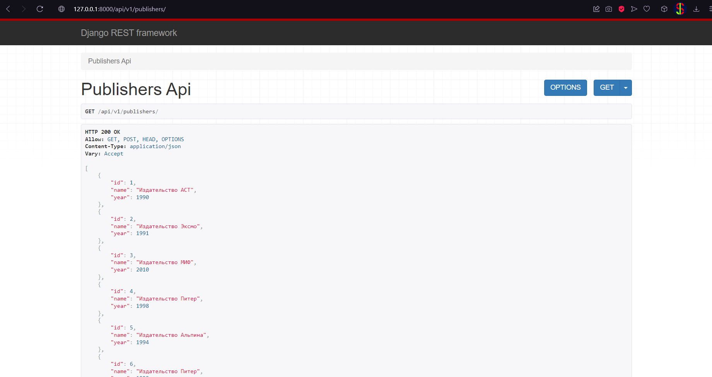
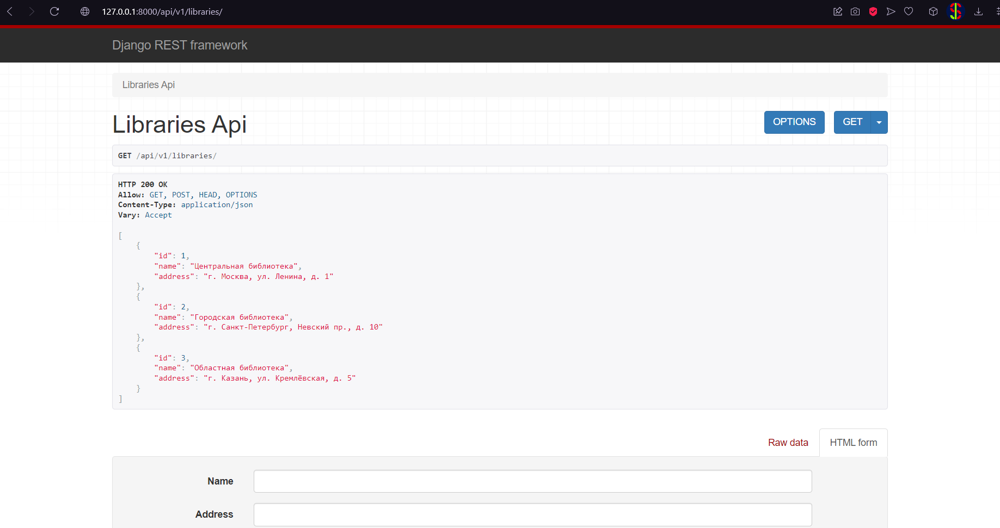
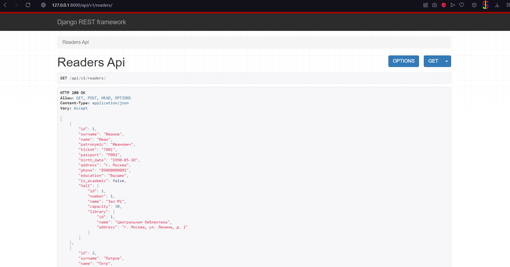
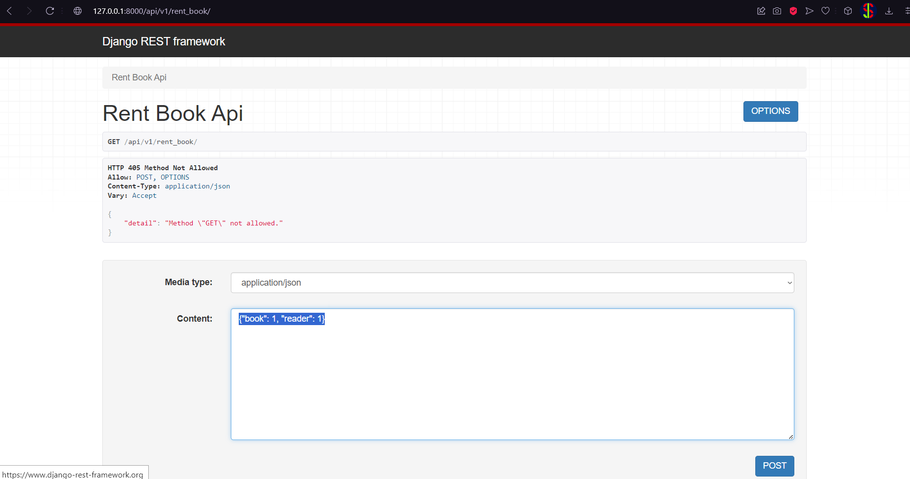
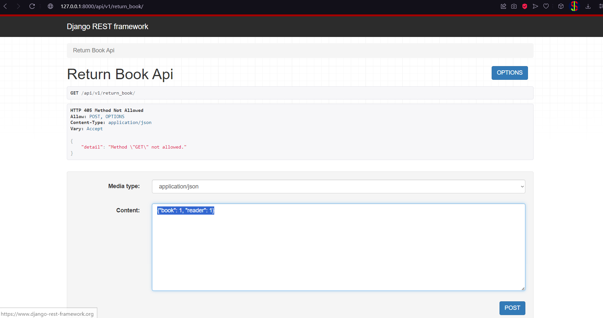

## **Задание**

В рамках лабораторной работы были выполнены задачи, связанные с проектированием моделей базы данных, реализацией API с использованием Django REST Framework (DRF), а также функционалами работы с моделями через Django ORM.

## **Проектирование моделей**  

Созданы модели для работы с библиотечной системой:

- `Publisher` — издатель книг.
- `Author` — авторы книг.
- `Book` — книги с привязкой к издателям.
- `Library` — библиотеки.
- `Hall` — залы библиотек с указанием вместимости и привязкой к библиотеке.
- `Reader` — читатели с информацией о привязке к залам и личных данных.
- `BookAuthor` — связь многих-ко-многим между книгами и авторами.
- `BookReader` — учет выдачи книг читателям с указанием сроков.
- `BookHall` — количество экземпляров книги в залах.

`views.py`
```python
from datetime import date
from rest_framework import status
from rest_framework.views import APIView, Response
from rest_framework.generics import RetrieveUpdateDestroyAPIView, ListCreateAPIView
from .serializer import *


class BooksAPIView(ListCreateAPIView):
    queryset = Book.objects.all()

    def get_serializer_class(self):
        if self.request.method in ['GET']:
            return BookReadSerializer
        return BookWriteSerializer


class BookAPIView(RetrieveUpdateDestroyAPIView):
    queryset = Book.objects.all()

    def get_serializer_class(self):
        if self.request.method in ['GET']:
            return BookReadSerializer
        return BookWriteSerializer


class AuthorsAPIView(ListCreateAPIView):
    serializer_class = AuthorSerializer
    queryset = Author.objects.all()


class AuthorAPIView(RetrieveUpdateDestroyAPIView):
    serializer_class = AuthorSerializer
    queryset = Author.objects.all()


class PublishersAPIView(ListCreateAPIView):
    serializer_class = PublisherSerializer
    queryset = Publisher.objects.all()


class PublisherAPIView(RetrieveUpdateDestroyAPIView):
    serializer_class = PublisherSerializer
    queryset = Publisher.objects.all()


class LibrariesAPIView(ListCreateAPIView):
    serializer_class = LibrarySerializer
    queryset = Library.objects.all()


class LibraryAPIView(RetrieveUpdateDestroyAPIView):
    serializer_class = LibrarySerializer
    queryset = Library.objects.all()


class HallsAPIView(ListCreateAPIView):
    queryset = Hall.objects.all()

    def get_serializer_class(self):
        if self.request.method in ['GET']:
            return HallReadSerializer
        return HallWriteSerializer


class HallAPIView(RetrieveUpdateDestroyAPIView):
    queryset = Hall.objects.all()

    def get_serializer_class(self):
        if self.request.method in ['GET']:
            return HallReadSerializer
        return HallWriteSerializer


class ReadersAPIView(ListCreateAPIView):
    queryset = Reader.objects.all()

    def get_serializer_class(self):
        if self.request.method in ['GET']:
            return ReaderReadSerializer
        return ReaderWriteSerializer


class ReaderAPIView(RetrieveUpdateDestroyAPIView):
    queryset = Reader.objects.all()

    def get_serializer_class(self):
        if self.request.method in ['GET']:
            return ReaderReadSerializer
        return ReaderWriteSerializer


class RentBookAPIView(APIView):
    def post(self, request):
        serializer = BookReaderRequestSerializer(data=request.data)

        if serializer.is_valid():
            book_id = serializer.validated_data['book']
            reader_id = serializer.validated_data['reader']

            try:
                book = Book.objects.get(id=book_id)
                reader = Reader.objects.get(id=reader_id)
            except (Book.DoesNotExist, Reader.DoesNotExist):
                return Response({"detail": "Book or Reader not found"}, status=status.HTTP_404_NOT_FOUND)

            hall = reader.hall

            book_hall = BookHall.objects.filter(book=book, hall=hall).first()

            if not book_hall or book_hall.count <= 0:
                return Response({"detail": "Book not available in this hall"}, status=status.HTTP_400_BAD_REQUEST)

            book_reader = BookReader(book=book, reader=reader, start_date=date.today())
            book_reader.save()

            book_hall.count -= 1
            book_hall.save()

            return Response({"detail": "Book rented successfully"}, status=status.HTTP_200_OK)

        return Response(serializer.errors, status=status.HTTP_400_BAD_REQUEST)


class ReturnBookAPIView(APIView):
    def post(self, request):
        serializer = BookReaderRequestSerializer(data=request.data)

        if serializer.is_valid():
            book_id = serializer.validated_data['book']
            reader_id = serializer.validated_data['reader']

            try:
                book = Book.objects.get(id=book_id)
                reader = Reader.objects.get(id=reader_id)
            except (Book.DoesNotExist, Reader.DoesNotExist):
                return Response({"detail": "Book or Reader not found"}, status=status.HTTP_404_NOT_FOUND)

            hall = reader.hall

            book_hall = BookHall.objects.filter(book=book, hall=hall).first()

            if not book_hall:
                return Response({"detail": "Book not available in this hall"}, status=status.HTTP_400_BAD_REQUEST)

            book_reader = BookReader.objects.filter(book=book, reader=reader, end_date=None).first()
            if not book_reader:
                return Response({"detail": "Reader doesn't have this book"}, status=status.HTTP_400_BAD_REQUEST)

            book_reader.end_date = date.today()
            book_reader.save()

            book_hall.count += 1
            book_hall.save()

            return Response({"detail": "Book returned successfully"}, status=status.HTTP_200_OK)

        return Response(serializer.errors, status=status.HTTP_400_BAD_REQUEST)


class AddBookAPIView(APIView):
    def post(self, request):
        serializer = AddBookRequestSerializer(data=request.data)

        if serializer.is_valid():
            book_id = serializer.validated_data['book']
            hall_id = serializer.validated_data['hall']
            amount = serializer.validated_data['amount'] if 'amount' in serializer.validated_data else 1

            try:
                book = Book.objects.get(id=book_id)
                hall = Hall.objects.get(id=hall_id)
            except (Book.DoesNotExist, Hall.DoesNotExist):
                return Response({"detail": "Book or Hall not found"}, status=status.HTTP_404_NOT_FOUND)

            book_hall = BookHall.objects.filter(book=book, hall=hall).first()
            if not book_hall:
                book_hall = BookHall(book=book, hall=hall, count=amount)
            else:
                book_hall.count += amount
            book_hall.save()

            return Response({"detail": "Book added successfully"}, status=status.HTTP_200_OK)

        return Response(serializer.errors, status=status.HTTP_400_BAD_REQUEST)


class RemoveBookAPIView(APIView):
    def post(self, request):
        serializer = AddBookRequestSerializer(data=request.data)

        if serializer.is_valid():
            book_id = serializer.validated_data['book']
            hall_id = serializer.validated_data['hall']
            amount = serializer.validated_data['amount'] if 'amount' in serializer.validated_data else 1

            try:
                book = Book.objects.get(id=book_id)
                hall = Hall.objects.get(id=hall_id)
            except (Book.DoesNotExist, Hall.DoesNotExist):
                return Response({"detail": "Book or Hall not found"}, status=status.HTTP_404_NOT_FOUND)

            book_hall = BookHall.objects.filter(book=book, hall=hall).first()

            if not book_hall:
                return Response({"detail": "Book not available in this hall"}, status=status.HTTP_400_BAD_REQUEST)

            book_hall.count -= amount
            if book_hall.count <= 0:
                book_hall.delete()
            else:
                book_hall.save()

            return Response({"detail": "Book removed successfully"}, status=status.HTTP_200_OK)

        return Response(serializer.errors, status=status.HTTP_400_BAD_REQUEST)
```

`serializer.py`

```python
from .models import *
from rest_framework import serializers


class PublisherSerializer(serializers.ModelSerializer):
    class Meta:
        model = Publisher
        fields = ["id", "name", "year"]


class AuthorSerializer(serializers.ModelSerializer):
    class Meta:
        model = Author
        fields = ["id", "surname", "name", "patronymic"]


class BookReadSerializer(serializers.ModelSerializer):
    authors = serializers.SerializerMethodField()
    publisher = PublisherSerializer()

    class Meta:
        model = Book
        fields = ['id', 'name', 'publisher', 'cipher', 'authors']

    def get_authors(self, obj):
        authors = Author.objects.filter(bookauthor__book=obj)
        return AuthorSerializer(authors, many=True).data


class BookWriteSerializer(serializers.ModelSerializer):
    authors = serializers.PrimaryKeyRelatedField(
        many=True, queryset=Author.objects.all(), write_only=True
    )

    class Meta:
        model = Book
        fields = ['id', 'name', 'publisher', 'cipher', 'authors']

    def create(self, validated_data):
        authors_data = validated_data.pop('authors')
        book = Book.objects.create(**validated_data)
        BookAuthor.objects.bulk_create([
            BookAuthor(book=book, author=author) for author in authors_data
        ])
        return book

    def update(self, instance, validated_data):
        authors_data = validated_data.pop('authors', None)
        if authors_data is not None:
            BookAuthor.objects.filter(book=instance).delete()
            BookAuthor.objects.bulk_create([
                BookAuthor(book=instance, author=author) for author in authors_data
            ])
        return super().update(instance, validated_data)


class LibrarySerializer(serializers.ModelSerializer):
    class Meta:
        model = Library
        fields = ["id", "name", "address"]


class HallReadSerializer(serializers.ModelSerializer):
    library = LibrarySerializer()

    class Meta:
        model = Hall
        fields = ["id", "number", "name", "capacity", "library"]


class HallWriteSerializer(serializers.ModelSerializer):
    library = serializers.PrimaryKeyRelatedField(queryset=Library.objects.all())

    class Meta:
        model = Hall
        fields = ["id", "number", "name", "capacity", "library"]

    def update(self, instance, validated_data):
        library_data = validated_data.pop('library', None)

        if library_data:
            instance.library = Library.objects.get(id=library_data.id)

        for attr, value in validated_data.items():
            setattr(instance, attr, value)

        instance.save()
        return instance


class ReaderReadSerializer(serializers.ModelSerializer):
    hall = HallReadSerializer()

    class Meta:
        model = Reader
        fields = ["id", "surname", "name", "patronymic", "ticket", "passport", "birth_date", "address", "phone", "education", "is_academic", "hall"]


class ReaderWriteSerializer(serializers.ModelSerializer):
    hall = serializers.PrimaryKeyRelatedField(queryset=Hall.objects.all())

    class Meta:
        model = Reader
        fields = ["id", "surname", "name", "patronymic", "ticket", "passport", "birth_date", "address", "phone", "education", "is_academic", "hall"]

    def update(self, instance, validated_data):
        hall_data = validated_data.pop('hall', None)

        if hall_data:
            instance.hall = Hall.objects.get(id=hall_data.id)

        for attr, value in validated_data.items():
            setattr(instance, attr, value)

        instance.save()
        return instance


class BookReaderRequestSerializer(serializers.Serializer):
    book = serializers.IntegerField()
    reader = serializers.IntegerField()


class AddBookRequestSerializer(serializers.Serializer):
    book = serializers.IntegerField()
    hall = serializers.IntegerField()
    amount = serializers.IntegerField(required=False, min_value=1)
```

`urls.py`
```python
from django.urls import path
from .views import *

app_name = "library"

urlpatterns = [
   path('books/', BooksAPIView.as_view()),
   path('books/<int:pk>', BookAPIView.as_view()),
   path('authors/', AuthorsAPIView.as_view()),
   path('authors/<int:pk>', AuthorAPIView.as_view()),
   path('publishers/', PublishersAPIView.as_view()),
   path('publishers/<int:pk>', PublisherAPIView.as_view()),
   path('libraries/', LibrariesAPIView.as_view()),
   path('libraries/<int:pk>', LibraryAPIView.as_view()),
   path('halls/', HallsAPIView.as_view()),
   path('halls/<int:pk>', HallAPIView.as_view()),
   path('readers/', ReadersAPIView.as_view()),
   path('readers/<int:pk>', ReaderAPIView.as_view()),

   path('rent_book/', RentBookAPIView.as_view()),
   path('return_book/', ReturnBookAPIView.as_view()),
   path('add_book/', AddBookAPIView.as_view()),
   path('remove_book/', RemoveBookAPIView.as_view())
]
```

## **Реализация API**  
   
С помощью Django REST Framework разработан API для работы с библиотечной системой:

- CRUD-операции для `Publisher`, `Author`, `Book`, `Library`, `Hall`, `Reader`.
- **Реализован API-запрос для выдачи книги**:
  - Проверка наличия книги в зале, к которому привязан читатель.
  - Уменьшение количества экземпляров книги в зале при выдаче.
  - Создание записи в таблице `BookReader` с указанием `start_date`.
- **Реализован API-запрос для возврата книги**:
  - Поиск записи о выдаче книги с самой ранней датой.
  - Установка `end_date` текущей датой.
  - Увеличение количества экземпляров книги в зале при возврате.
- **Реализован API-запрос для добавления книги в зал**:
  - Проверка существования книги и зала.
  - Если книга отсутствует в указанном зале, создается запись в таблице `BookHall`.
  - Если книга уже есть в зале, увеличивается количество экземпляров.
- **Реализован API-запрос для удаления книги из зала**:
  - Проверка существования книги в зале.
  - Если количество экземпляров после удаления меньше или равно нулю, запись из `BookHall` удаляется.
  - Иначе количество экземпляров обновляется.

## **Скриншоты:**









