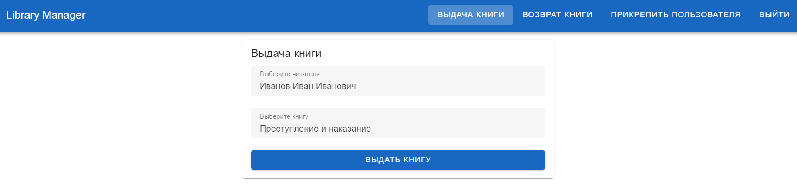
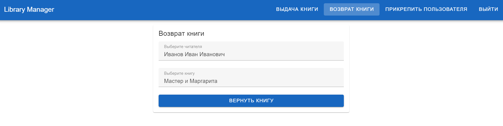
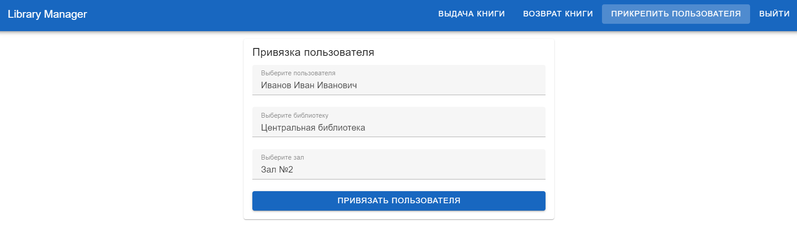

## **Интерфейс библиотекаря**

Этот раздел описывает интерфейс для библиотекаря, который управляет выдачей книг, возвратом и прикреплением пользователей к читательским залам.

## **Выдача книги**

В разделе «Выдача книги» библиотекарь выбирает читателя и книгу для выдачи.

## **Возврат книги**

В разделе «Возврат книги» библиотекарь выбирает книгу и читателя для возврата книги.

## **Прикрепить пользователя**

В разделе «Прикрепить пользователя» библиотекарь прикрепляет читателя к выбранному читательскому залу.

