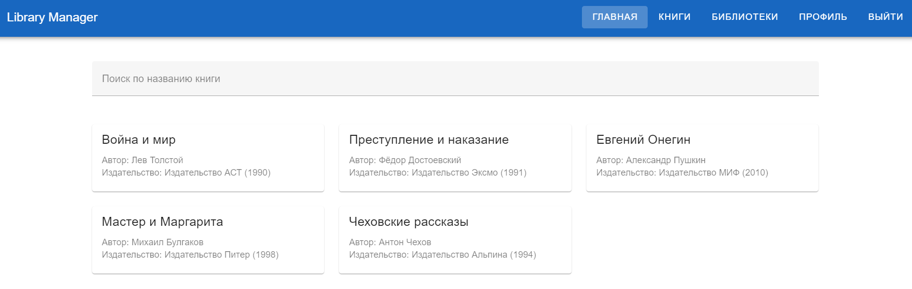
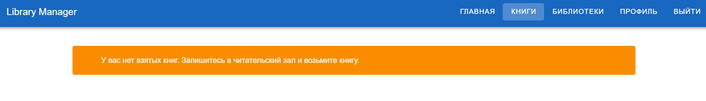
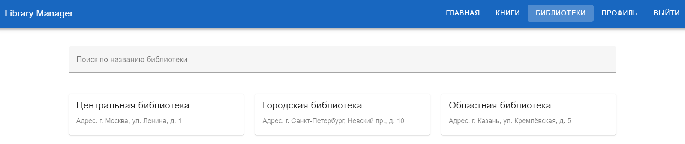
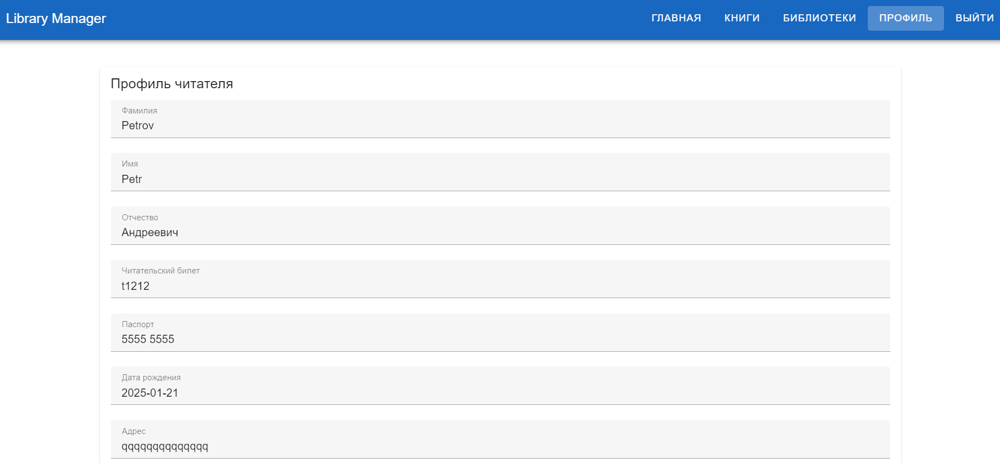

## **Интерфейс читателя**

Этот раздел описывает интерфейс для обычного пользователя, который использует систему для поиска и получения книг.

## **Главная страница**

На главной странице пользователь видит список доступных книг. Здесь можно выполнять поиск по названию книги.

## **Книги**

Здесь пользователь видит, какие книги у него сейчас на руках, то есть те, которые ему нужно будет вернуть в библиотеку в будущем.

## **Библиотеки**

Тут можно просмотреть доступные библиотеки, в которые можно впоследствии прийти и записаться в читательский зал.

## **Профиль**

В этом разделе читатель может отредактировать информацию о себе и сохранить ее.

